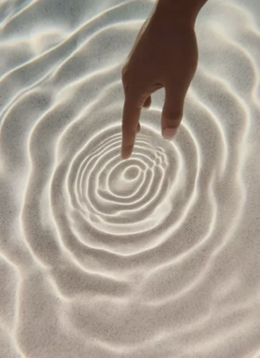
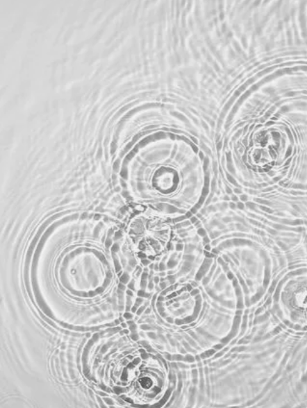
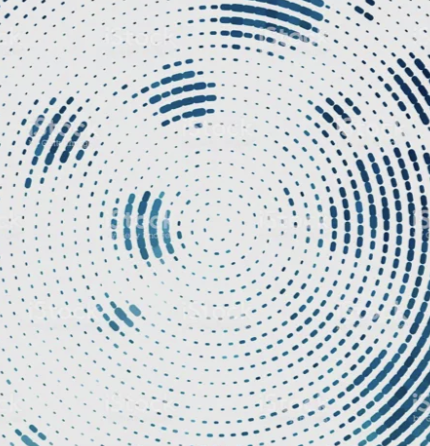
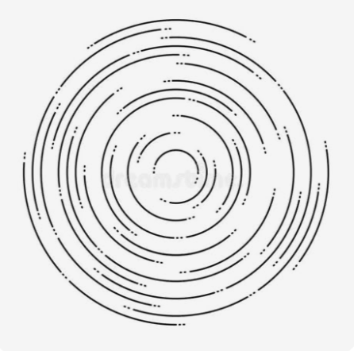
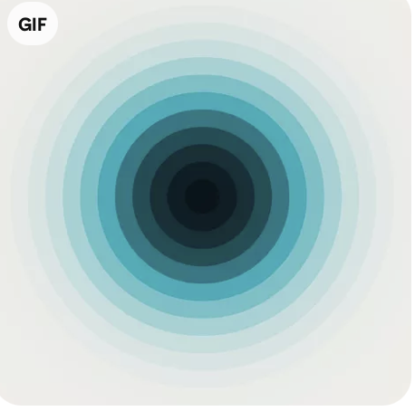
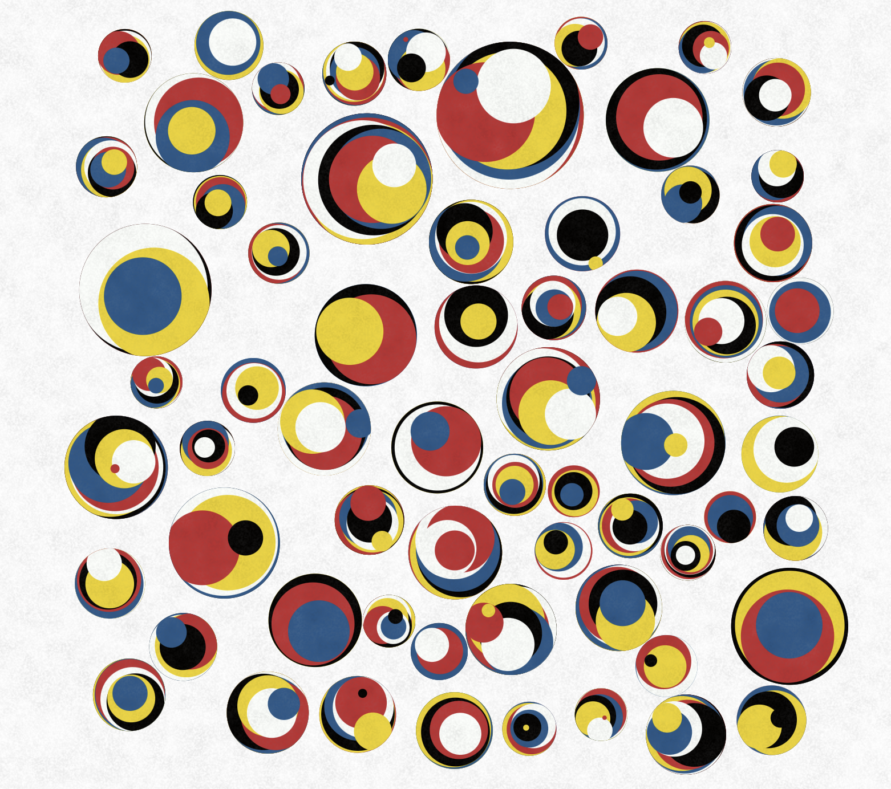
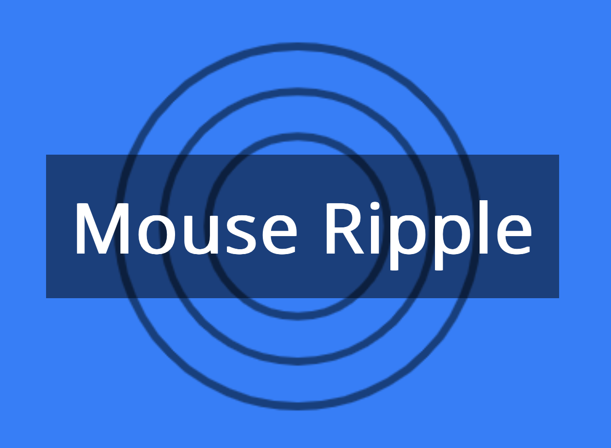

# Jxin0046_9103_tut3

This is my first change of local file.

# Quiz8 

## Imaging inspiration

Our team work inspiration is **Ripple** .

Ripple is a flexible pattern to change or represent. Such as Points, Lines or Surface. Here is some Ref photos as followings:

Based on that, ripple is a strong concept for showing diffferent interactive inputs. The pattern changes can be triggered by different inputs such as: audio, mouse actions, or just time-based.

## Coding inspiration

** Inspiration 1

[link text](https://openprocessing.org/sketch/2490490)

From the Inspiration code work: Random position for each cirlce. Continuing generate new circle from its base circle. Those features may contribute to our ripples : Random Positions and "endless" fluctuation.

** Inspiration 2

[link text](https://happycoding.io/tutorials/p5js/input/mouse-ripple)

From the inspiration code work: Basic ripple trrigered by a mouse click. 
